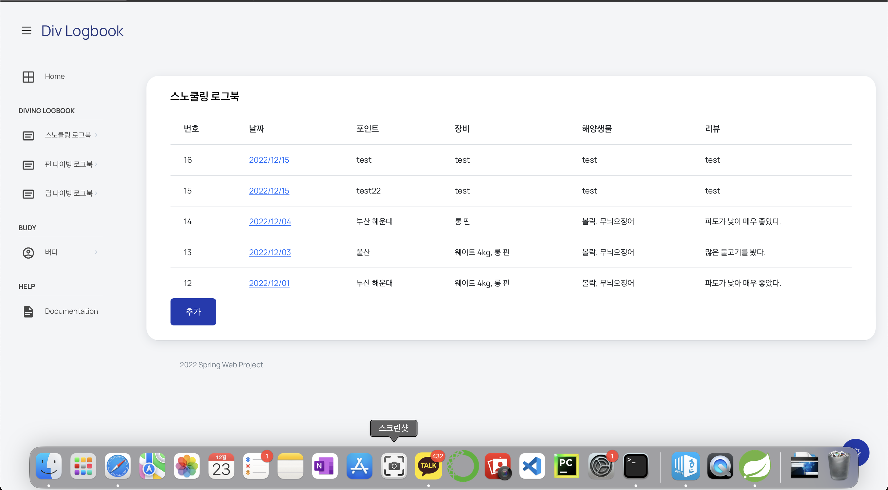

2022 2학년 2학기 Spring Web Project
=================================

### 프로젝트 개요

프리다이빙 로그북은 프리다이빙을 즐긴 후 포인트, 날짜, 장비, 리뷰 등을 기록할 수 있는 웹사이트이다. 기존의 프리다이빙 로그북은 한글지원이 되지 않는 경우가 많으며 수심별, 용도별 다르게 기록할 수 있는 기능을 제공하지 않는다. 따라서 프로젝트는 이러한 보안점을 수정하여 사용자 편의를 높이는 것에 목적이 있다.

웹사이트에서는 수심별 다이빙 기록을 분류할 수 있다. 가장 먼저 낮은 수심의 스노쿨링과 20미터 이내의 펀 다이빙, 20미터 이상의 딥 다이빙으로 나누었다. 이렇게 수심별로 다르게 기록하면 착용 장비, 포인트 등을 쉽게 구분할 수 있어 편리하다.

### 개발환경 및 도구

웹 서버 : tomcat 9.0

언어 : JSP / Srping

DB : MariaDB

IDE : STS3

### DB 구성

### 화면 구성

### 맺음말

기본적인 CRUD를 모두 구현하였다. DB에 데이터를 리스트 형식으로 출력하고, 기록, 업데이트, 삭제 할 수 있도록 했다. 하지만 자바 스크립트가 작동하지 않아 더 많은 기능을 구현하지는 못했다. 정확하게 이유를 파악하진 못했지만 자바 스크립트 파일이 에러가 발생하여 모달창과 같은 기능을 구현하지 못하였다.

또 추가적으로 DB에 버디 이름과 나머지 list table들과 연결하여 누구와 함께 다이빙 하였는지 출력할 수 있도록 하는 기능을 추가할 예정이다.

해양동물, 장비 등은 select로 표현하여 저장할 수 있도록 하는 기능 역시 추가할 예정이다.

### 소감

스프링 프로젝트를 진행하면서 이전 학기에서 배웠던 MVC 구현을 쉽게 할 수 있어 편리했고, 기능구현이 매우 간단하게 진행 되었다.

하지만 프로젝트 처음부터 구현하고 싶었던 지도 API를 활용한 마커 기능이나, 이미지를 넣는 등의 기능을 구현하지 못해 아쉬움이 많이 남는다.

개인적으로 공부를 계속 하면서 오늘의 프로젝트를 완성시킬 수 있도록 노력할 예정이다.

### 참

김진숙 교수님의 예시 프로젝트(https://github.com/aicsdit/board-spring)
Spring 기초 개념(https://programforlife.tistory.com/103)